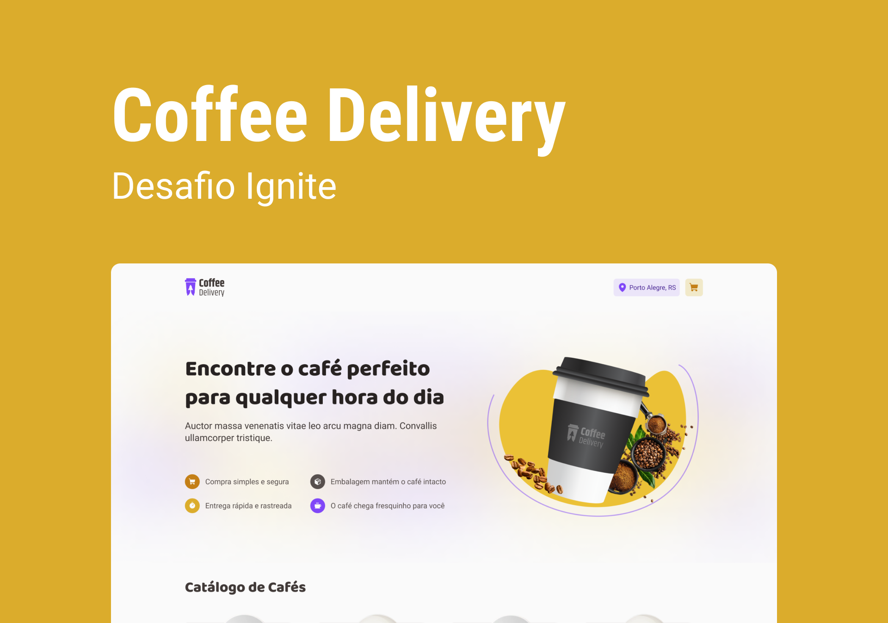

<h1 align="center">
  
</h1>

<h1 align="center">
  
</h1>

# Sobre o projeto

<p>
  Coffee Delivery é uma loja fictícia para venda de cafés com entrega rápida, segura e rastreada. Que faz parte de um dos desafios do módulo 02 da trilha de Reactjs do Ignite da Rocketseat.
</p>

# Tecnologias

- [TypeScript](https://www.typescriptlang.org/)
- [Tailwindcss](https://tailwindcss.com/)
- [NextJs](https://nextjs.org/)
- [React Hook Form](https://react-hook-form.com/)
- [Zod](https://zod.dev/)
- [Immer](https://immerjs.github.io/immer/)
- [Radix UI](https://www.radix-ui.com/)
- [Phosphor Icons](https://phosphoricons.com/)

## Como baixar o projeto

```bash
# Clonar o repositório
$ git clone https://github.com/wellingtonrodriguesbr/coffee-delivery-next.git

# Entrar no diretório
$ cd coffee-delivery-next


# Instalar as dependências
$ npm install

# Rodar o projeto
$ npm run dev
```

<br/>
<hr/>

<p align="center">Desenvolvido por <a href="https://www.linkedin.com/in/wellingtonrodriguesbr/" target="_blank">Wellington Rodrigues</a> ✌🏽</p>
